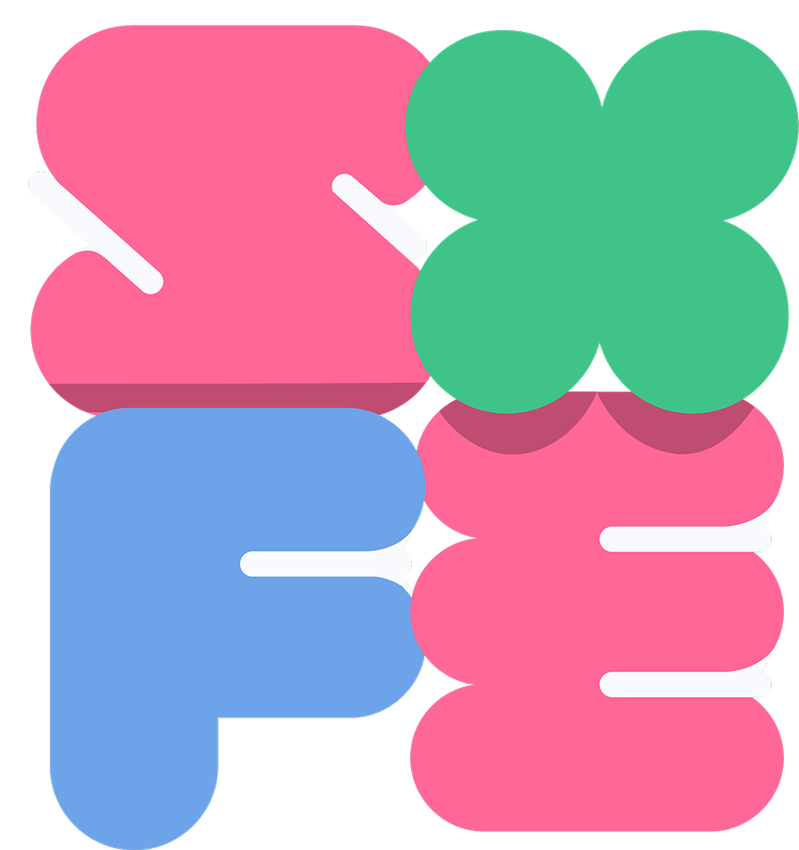
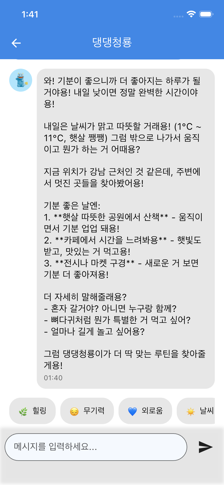
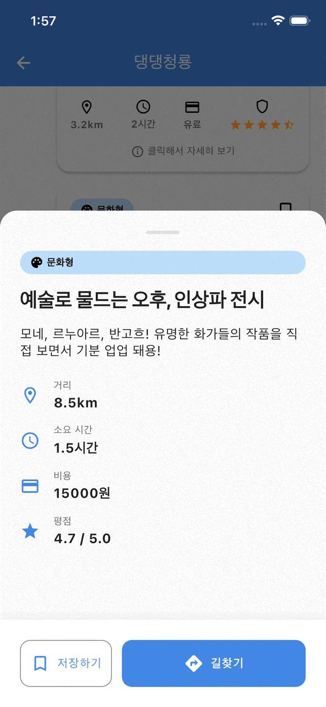
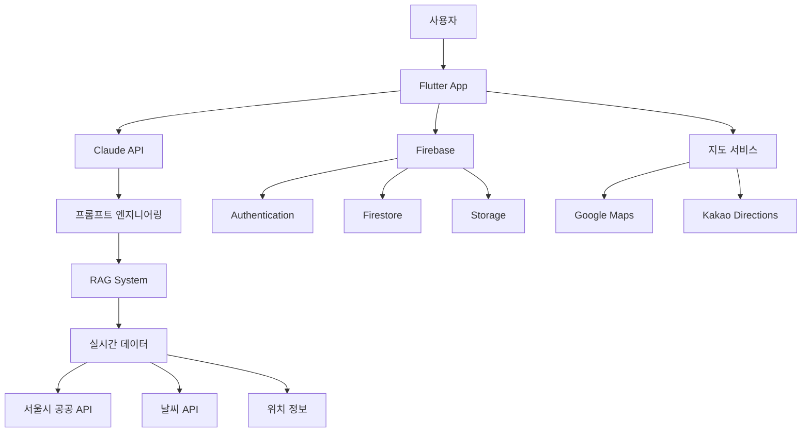

# 🌈 SOFE - Story Of Feeling Everyday

<div align="center">
  

**당신의 감정에 귀 기울이는 AI 일상 가이드**

[](https://flutter.dev)
[](https://anthropic.com)
[](https://firebase.google.com)

[📱 Demo Video]() | [📊 Presentation]() | [🎯 Seoul 365 Challenge](https://sihsc.welfare.seoul.kr/letsdoseoul/main.do)
</div>

---

## 📖 프로젝트 소개

**"오늘 기분이 어때?"**

SOFE는 사용자의 감정을 AI가 실시간으로 분석하여, 서울의 365개 도전과제와 연계한 맞춤형 일상 루틴을 추천하는 감정 기반 AI 웰니스 서비스입니다.

### 🎯 목표
- 도시 생활자의 감정적 웰빙 증진
- AI 기술을 활용한 초개인화 일상 경험 제공
- 서울시 공공데이터와 AI의 창의적 융합

---

## ✨ 핵심 차별점

### 🤖 AI 기술의 혁신적 활용

#### 1. **Claude API + RAG 기반 실시간 데이터 연동**
```python
# 프롬프트 엔지니어링의 핵심
- 실시간 공공데이터 4종 연동 (문화행사, 관광정보, 공원, 날씨)
- 토큰 최적화: Prompt Caching으로 5분간 컨텍스트 유지
- 위치 기반 필터링: 5km 반경 데이터만 선별하여 효율성 극대화
```

#### 2. **감정 인식 & 맞춤형 추천 알고리즘**
- 자연어 처리를 통한 6가지 감정 패턴 분석 (힐링, 무기력, 외로움, 날씨, 예산, 근처)
- 사용자 컨텍스트 기반 3단계 루틴 제안 (힐링형, 활력형, 문화형)

#### 3. **캐릭터 페르소나 AI**
- 서울시 공식 캐릭터 3종의 고유 성격과 말투 완벽 재현
- 각 캐릭터별 특화된 추천 스타일 구현

---

## 🚀 주요 기능

### ✅ 구현 완료 (현재 작동 중)

#### 1. AI 감정 대화 시스템
<details>
<summary>🔍 상세 보기</summary>

- **Claude API 스트리밍 채팅**: 실시간 타이핑 효과로 자연스러운 대화 경험
- **캐릭터별 페르소나**: 소울해치(힐링), 댕댕청룡(재미), 돌격백호(도전)
- **감정 태그 시스템**: 원터치로 감정 상태 전달
- **예시 질문 제공**: 대화 시작을 돕는 상황별 가이드

  

 

</details>

#### 2. 감정 기반 장소 추천
<details>
<summary>🔍 상세 보기</summary>

- **실시간 RAG 시스템**: 4종의 서울시 공공 API 데이터 통합
    - 문화행사 정보 (20개/일)
    - VisitSeoul 관광 콘텐츠 (50개)
    - 주요 공원 현황 (위치 기반 필터링)
    - 문화공간 정보 (5km 반경)
- **스마트 추천 카드**: 카테고리, 거리, 소요시간, 비용 정보 제공
- **상황 감지**: 날씨, 시간대, 위치 자동 반영


</details>

#### 3. 지도 연동 & 경로 안내
<details>
<summary>🔍 상세 보기</summary>

- **Google Maps 통합**: 실시간 위치 추적 및 목적지 안내
- **Kakao Directions API**: 최적 경로 계산 (도보/대중교통)
- **도착 인증 시스템**: 50m 반경 자동 인식 → 5분 타이머 → 인증샷 촬영
- **커스텀 마커**: 애니메이션 캐릭터로 현재 위치 표시


</details>

#### 4. 기타 완성 기능
- **Firebase 인증**: 소셜 로그인 및 프로필 관리
- **여행 보관함**: 인증샷 갤러리 및 추천 히스토리
- **채팅 프로필**: 대화 내용 요약 및 선호도 학습

### 🔮 개발 예정 (본선 목표)

#### 🎵 AI 음악 생성 (MusicGen API)
```yaml
기능: 감정 상태에 맞는 배경음악 실시간 생성
기술: Meta MusicGen + 감정 분석 연동
효과: 청각적 힐링 경험 제공
상태: 프로토타입 개발 중
```

#### 📊 감정 분석 대시보드
- 주/월별 감정 변화 추이
- 웰니스 점수 시각화
- 맞춤형 루틴 성과 분석

---

## 🛠 기술 스택

### Frontend


### AI & ML


### Backend & Database


### APIs


---

## 🏗 시스템 아키텍처


---

## 🧠 프롬프트 엔지니어링 상세

### RAG (Retrieval-Augmented Generation) 구현
```dart
// 실시간 데이터 통합 프롬프트 구조
class PromptBuilder {
  static String buildSystemPrompt({
    Character? character,           // 캐릭터 페르소나
    List<CulturalEvent> events,    // 실시간 문화행사
    List<ContentInfo> contents,    // 관광 콘텐츠
    List<ParkInfo> parks,          // 공원 정보
    String? weather,               // 날씨 예보
    Position? location,            // 현재 위치
  }) {
    // 1. 토큰 최적화: 5km 반경 필터링
    final filteredData = filterByDistance(data, location, 5000);
    
    // 2. Prompt Caching 활용
    return {
      'system': [{
        'type': 'text',
        'text': systemPrompt,
        'cache_control': {'type': 'ephemeral'}, // 5분간 캐싱
      }]
    };
  }
}
```

### 토큰 사용 최적화 전략

| 최적화 기법 | 절감 효과 | 구현 상태 |
|------------|----------|-----------|
| 위치 기반 필터링 | 70% 감소 | ✅ 완료 |
| Prompt Caching | 50% 감소 | ✅ 완료 |
| 메시지 히스토리 제한 | 30% 감소 | ✅ 완료 |
| 데이터 요약화 | 40% 감소 | ✅ 완료 |

---

## 👥 팀 소개

### Team SOFE

| 역할 | 이름                                     | 담당 업무 |
|------|----------------------------------------|-----------|
| 🎯 **팀장/개발** | [김민영](https://github.com/AhcoForever)  | Flutter 개발, AI 통합, 시스템 설계 |
| 📋 **기획** | [김수현] (https://github.com/artishk52) | 서비스 기획, UX 설계, 프로젝트 관리 |
| 🎨 **디자인** | [소아연] (https://github.com/ayeoniiii) | UI/UX 디자인, 브랜딩 |
| 🔍 **리서치** | [유승화] (https://github.com/9121awh) | 데이터 분석, 사용자 조사, API 연구 |

---

## 📈 개발 현황

### 진행률: 75%

- [x] AI 채팅 시스템 (100%)
- [x] 감정 기반 추천 (100%)
- [x] 지도 연동 (100%)
- [x] 인증 시스템 (90%)
- [x] 사용자 프로필 (80%)
- [ ] AI 음악 생성 (20%)
- [ ] 감정 대시보드 (10%)


## 🚦 실행 방법
```bash
# 1. 저장소 클론
git clone https://github.com/AhcoForever/2025-sessac-tour

# 2. 의존성 설치
flutter pub get

# 3. API 키 설정 (lib/core/config.dart)
- Claude API Key
- Google Maps API Key
- Kakao REST API Key
- Firebase 설정

# 4. 실행
flutter run
```

---

## 📅 향후 계획

### 본선 준비 (~12월)
- [ ] MusicGen API 통합 완료
- [ ] 감정 대시보드 구현
- [ ] UI/UX 개선

---

<div align="center">
  <b>2025 SeSAC 해커톤 출품작</b><br>
  Made with ❤️ by Team 새싹투어
</div>


---

📄 **[기획서 보기](docs/기획서.pdf)**  
🎥 **[데모 영상 보기](https://youtube.com/...)**  

