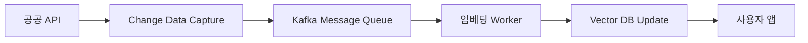

# 📋 SOFE 확장 로드맵 (Expansion Roadmap)

> 서비스 규모 확대 및 사용자 경험 고도화를 위한 향후 개선 계획

---

## 🎯 현재 구현 현황

### ✅ AI 대화 시스템 (완료)
- **Claude API 기반 실시간 대화**: 스트리밍 응답으로 자연스러운 대화 제공
- **프롬프트 데이터 주입 방식**: 서울시 공공 API 4종의 데이터를 실시간으로 프롬프트에 포함
  - 문화행사 정보 (20개/일)
  - 관광 콘텐츠 (50개)
  - 공원 현황 (위치 기반 필터링)
  - 문화공간 정보 (5km 반경)
- **Prompt Caching 활용**: 5분간 컨텍스트 유지로 토큰 비용 절감

### 현재 방식의 한계
```
사용자 질문 → API 호출 (매번) → 데이터 필터링 → 프롬프트 구성 → Claude 응답
```
- 실시간 API 호출로 인한 응답 지연 (평균 3-5초)
- 데이터 양이 증가할 경우 토큰 비용 급증
- 의미 기반 검색 불가 (키워드 매칭 수준)

---

## 🚀 향후 확장 계획

### 1️⃣ RAG (Retrieval-Augmented Generation) 시스템 도입 ⭐

**도입 시기**: 서비스 정식 출시 및 사용자 1만명 돌파 시

#### 📌 목표
대규모 관광 데이터를 효율적으로 처리하고, 사용자 의도를 정확히 파악한 맥락 기반 답변 제공

#### 🛠 구현 계획

##### Phase 1: 벡터 데이터베이스 구축
```yaml
기술 스택:
  - 벡터 DB: Pinecone / Weaviate / Chroma DB 검토
  - 임베딩 모델: OpenAI text-embedding-3 / Voyage AI
  - 데이터 규모: 초기 10만개 → 목표 100만개

데이터 소스 확장:
  - 서울시 공공데이터: 20종 이상 (현재 4종)
  - 사용자 생성 리뷰 및 평가 데이터
  - 블로그/SNS 크롤링 데이터 (저작권 준수)
  - 날씨, 교통, 혼잡도 실시간 데이터
```

##### Phase 2: 의미 기반 검색 시스템
```python
# 현재: 키워드 필터링
if "공원" in user_input:
    return filter_parks()

# RAG 도입 후: 의미 기반 검색
user_embedding = embed("힐링되는 조용한 곳")
results = vector_db.similarity_search(
    query_embedding=user_embedding,
    filters={'category': 'healing', 'noise_level': 'low'},
    top_k=5
)
```

##### Phase 3: 하이브리드 검색
- **Semantic Search**: 사용자 의도 이해 (예: "힐링" → 공원, 카페, 미술관)
- **Keyword Search**: 정확한 장소명, 주소 검색
- **Metadata Filtering**: 거리, 비용, 영업시간 등 구조화된 필터

#### 💰 예상 비용 절감 효과
| 항목 | 현재 방식 | RAG 도입 후 |
|-----|---------|-----------|
| 평균 응답 시간 | 3-5초 | 1-2초 |
| 요청당 토큰 | 8,000-15,000 | 2,000-4,000 |
| 월 API 비용 (1만 사용자 가정) | $500-800 | $150-300 |
| 데이터 업데이트 주기 | 실시간 (매 요청) | 일 1회 배치 |

---

### 2️⃣ 개인화 추천 고도화

#### 📊 사용자 프로필 벡터 학습
```yaml
현재: 단순 히스토리 저장
→ 개선: 사용자 선호도 임베딩

학습 데이터:
  - 대화 내용 (감정 패턴)
  - 방문 장소 (카테고리, 위치)
  - 체류 시간, 재방문율
  - 날씨/시간대별 선호도

활용:
  - Collaborative Filtering: 유사 사용자 기반 추천
  - Cold Start 해결: 감정 태그만으로 초기 추천
```

#### 🎯 감정-장소 매칭 모델 Fine-tuning
```
서비스 확대 시 수집할 데이터:
- 50만개 이상의 (감정, 추천장소, 만족도) 쌍
- 사용자 피드백 (별점, 재방문 의사)

목표:
- 추천 정확도 70% → 90% 향상
- 개인 맞춤형 특화 모델 제공
```

---

### 3️⃣ 멀티모달 AI 확장

#### 🖼 이미지 기반 감정 분석
```yaml
현재: 텍스트 기반 감정 인식
→ 추가: 사용자 업로드 사진 분석

기술:
  - Claude Vision API
  - 사진 속 표정, 장소 분위기 분석
  - "이 사진처럼 평화로운 곳 추천해줘"
```

#### 🎵 감정-음악 RAG 시스템
```yaml
현재 개발 중: MusicGen API 기본 연동
→ 향후: 음악 임베딩 기반 추천

데이터베이스:
  - 10만곡 이상의 무드 태그 음악 라이브러리
  - 사용자 감정 → 유사 음악 벡터 검색
  - 장소별 최적 BGM 자동 매칭
```

---

### 4️⃣ 인프라 확장

#### ☁️ 서버리스 → 전용 서버
```yaml
현재: Firebase (BaaS)
→ 확장: AWS / GCP Kubernetes 클러스터

이유:
  - 벡터 DB 운영 (GPU 필요)
  - 배치 임베딩 작업 (일 100만건)
  - 비용 최적화 (Firebase 종량제 → 정액제)
```

#### 🔄 실시간 데이터 파이프라인


---

## 📈 단계별 로드맵

### 🥉 Stage 1: 프로토타입 검증 (현재)
- ✅ 기본 AI 대화 시스템
- ✅ 4종 API 실시간 연동
- ⏳ 사용자 피드백 수집 (목표: 1,000명)

### 🥈 Stage 2: MVP 출시 (3개월)
- RAG 시스템 PoC (Proof of Concept)
- 벡터 DB 초기 구축 (10만 데이터)
- A/B 테스트로 효과 검증

### 🥇 Stage 3: 정식 서비스 (6개월)
- 전체 RAG 시스템 마이그레이션
- 개인화 추천 모델 고도화
- 인프라 스케일링

### 🏆 Stage 4: 플랫폼화 (1년)
- 타 도시 확장 (부산, 제주 등)
- B2B API 제공 (관광업계)
- 멀티모달 AI 완성

---

## ⚠️ 기술적 과제 및 해결 방안

### 1. 초기 데이터 품질
**문제**: 공공 API 데이터 불완전 (누락, 중복, 오류)
**해결**:
- 데이터 정제 파이프라인 구축
- 커뮤니티 리포팅 시스템 (사용자 신고)
- 주기적 데이터 검증 자동화

### 2. 임베딩 비용
**문제**: 100만건 임베딩 비용 약 $200-500
**해결**:
- 증분 업데이트 (변경분만 재임베딩)
- 오픈소스 모델 검토 (SentenceTransformers)
- 배치 처리로 할인 적용

### 3. 레이턴시 관리
**문제**: 벡터 검색 + LLM 추론 시간
**해결**:
- 인덱싱 최적화 (HNSW 알고리즘)
- 엣지 캐싱 (CDN)
- 스트리밍 응답 유지

---

## 🎓 참고 자료

### RAG 시스템 구현 사례
- [LangChain RAG Tutorial](https://python.langchain.com/docs/use_cases/question_answering/)
- [Pinecone: Retrieval Augmented Generation](https://www.pinecone.io/learn/retrieval-augmented-generation/)
- [OpenAI Cookbook: RAG](https://cookbook.openai.com/examples/vector_databases/readme)

### 벡터 데이터베이스 비교
| 제품 | 장점 | 단점 | 가격 |
|-----|------|------|------|
| Pinecone | 관리형, 빠른 속도 | 비쌈 | $70/월~ |
| Weaviate | 오픈소스, 멀티모달 | 자체 운영 필요 | 무료 |
| Chroma | 간단한 구조 | 스케일링 제한 | 무료 |

---

## 💬 결론

**현재 SOFE는 프롬프트 기반 데이터 주입 방식으로 빠른 프로토타이핑에 성공했습니다.**

**RAG 시스템은 서비스 규모가 확대되고 데이터가 기하급수적으로 증가할 때 필수적인 아키텍처입니다.**

초기 사용자 검증 후 단계적으로 도입하여, 더욱 정확하고 개인화된 감정 기반 추천 서비스로 발전시킬 계획입니다.

